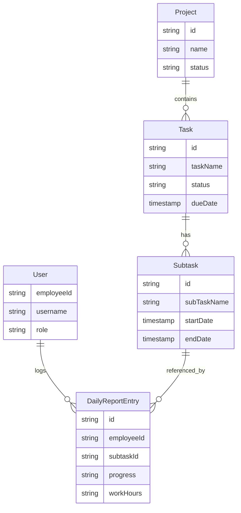

# Functional Specification

## 1. System Features

### [F-001] Authentication
- **Description**: User login system.
- **Key Components**: `frontend/src/app/login`
- **User Flow**: User enters credentials -> Validated against Firebase Auth -> Redirect to Dashboard.

### [F-002] Dashboard
- **Description**: Overview of project status and tasks.
- **Key Components**: `frontend/src/app/dashboard`
- **Data Usage**: Agreggated `Task` and `Project` data.
- **Features**:
    - **Overview Tab**: Statistics and graphs.
    - **Interactive Planning**: Gantt/Table view with "Top Bar Filter" (no header filters):
      - **Sorting**: Clickable headers to sort by ID, Name, Date, Status.
      - **Status Filter**: Multi-select dropdown supporting "Work Request" states and "RFA" categories.
      - **Search**: Text search filtering for "Relate Drawing" name.
      - **Reset**: Button to clear all active filters.
    - **Daily Report Tab**: Aggregated daily work hours with filters (Assignee, Date, Status).
        - **Default Filter**: Assignee defaults to current logged-in user.
        - **Future Date**: Rows for dates after today are rendered as "Future/Inactive" (Gray/Disabled) instead of "Missing".
        - **Leave Status**: Displays "Leave" (ลางาน) status if the day has **exactly 8 working hours** derived purely from tasks named "ลางาน" (Task Name).
        - **Alignment**:
            - **Headers**: All Center-Aligned.
            - **Data**: Numeric columns (Hours, OT) Right-Aligned, Status Center-Aligned.

### **[F-010] Public Holiday Management**
- **Goal**: Allow Supervisors to manage holidays for better reporting visualization.
- **Key Components**:
  - `DailyReport` Calendar (Visual)
  - `AddHolidayModal` (Input)
  - `publicHolidays` Collection (Data)
- **Rules**:
  - **Permission**: BimLeader/Manager only.
  - **Visuals**: Public Holiday (Purple), Sunday (Red).
  - **Visuals**: Public Holiday (Purple), Sunday (Red). Status indicators (Saved/New).
  - **Calendar**: Yellow Marker (Edited), Red Marker (Missing), Blue/Orange (Focus).
  - **Interaction**: Tooltip on hover (Holiday Name, Work Hours, Leave Status).
    - *Note*: Tooltip must calculate "Snapshot" values (Latest revision per day), excluding history or deleted items.
  - **Logic**: Stored by Date. Full CRUD (Bulk Add + Delete). Fetch by Year.

### [F-003] Daily Reporting
- **Description**: Users submit daily work reports (timesheets).
- **Key Components**: `frontend/src/app/daily-report`

- **Data Usage**: `DailyReportEntry`
- **Logic Refinements**:
    - **Deletion**: Uses "Soft Delete" strategy (status="deleted") to maintain audit trail.
    - **Validation**: Progress input is strictly bounded by previous and next day's entries.
    - **Future Date Filtering**: Restricts future date task selection to "Leave" only (Checked via Activity: "ลางาน").
    - **Activity-Based Logic**: Uses strict `Activity` (Task Category) field to identify "Leave" (ลางาน), "Project Meeting" (Project Meeting), and "Internal Meeting" tasks.
    - **Orphan Indication**: Visual highlighting (Red/Strikethrough) for entries where the referenced subtask has been deleted.
    - **Orphan Exclusion**: Working hours from deleted tasks (both Soft and Hard deleted) are excluded using a whitelist of valid subtasks.
    - **Editable Logic**: New unsaved entries allow clearing of selected Subtask; existing entries require "Edit" mode to unlock this field to prevent accidental changes.
    - **Progress Validation**: "Submit" is blocked if `Progress <= Initial Progress` (User must update progress), with exceptions for "Leave" and "Meeting" tasks.

### [F-004] Project Management
- **Description**: Manage projects.
- **Key Components**: `frontend/src/app/projects`
- **Data Usage**: `Project`

### [F-005] Task Management
- **Description**: View and manage tasks within projects.
- **Key Components**: `frontend/src/app/tasks`
- **Data Usage**: `Task`, `Subtask`
- **Data Quality Rules**:
    - **Subtask ID Format**: All Subtask IDs must be stored and displayed in UPPERCASE to ensure consistent matching and comparison across the system.
- **Safety Features**:
    - **Deletion Guard**: Prevents deletion of tasks/subtasks that have associated `DailyReportEntry` records to preserve data integrity.

### [F-006] Task Assignment
- **Description**: Assign tasks to users.
- **Key Components**: `frontend/src/app/task-assignment`

### [F-008] All Assign Filter
- **Description**: Filter to view all tasks assigned to the current user across all projects.
- **Key Components**: `frontend/src/app/tasks/page.tsx`
- **User Flow**: User selects "All Assign" from project dropdown -> System aggregates tasks from all projects where assignee matches current user -> Display in table.

### [F-009] Task Table Enhancements
- **Description**: UI improvements for task table including Due Date column, Sorting, and Filtering.
- **Key Components**: `frontend/src/app/tasks/page.tsx`
- **Features**:
    - **Due Date Column**: Display `endDate` or `dueDate`.
    - **Sorting**: Clickable headers to sort ASC/DESC.
    - **Filters**: Filter by Assignee Name and Date Range.
    - **UX**: Loading Overlay (Blur + Spinner) during data fetch.

### [F-007] Document Tracking
- **Description**: Track documents related to BIM.
- **Key Components**: `frontend/src/app/document-tracking`

## 2. Data Models (ER Diagram)

