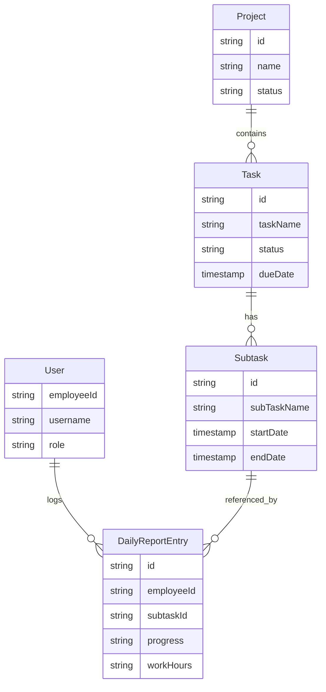

# Functional Specification

## 1. System Features

### [F-001] Authentication
- **Description**: User login system.
- **Key Components**: `frontend/src/app/login`
- **User Flow**: User enters credentials -> Validated against Firebase Auth -> Redirect to Dashboard.

### [F-002] Dashboard
- **Description**: Overview of project status and tasks.
- **Key Components**: `frontend/src/app/dashboard`
- **Data Usage**: Agreggated `Task` and `Project` data.
- **Features**:
    - **Overview Tab**: Statistics and graphs.
    - **Daily Report Tab**: Aggregated daily work hours with filters (Assignee, Date, Status).
        - **Default Filter**: Assignee defaults to current logged-in user.

### [F-003] Daily Reporting
- **Description**: Users submit daily work reports (timesheets).
- **Key Components**: `frontend/src/app/daily-report`

- **Data Usage**: `DailyReportEntry`
- **Logic Refinements**:
    - **Deletion**: Uses "Soft Delete" strategy (status="deleted") to maintain audit trail.
    - **Validation**: Progress input is strictly bounded by previous and next day's entries.

### [F-004] Project Management
- **Description**: Manage projects.
- **Key Components**: `frontend/src/app/projects`
- **Data Usage**: `Project`

### [F-005] Task Management
- **Description**: View and manage tasks within projects.
- **Key Components**: `frontend/src/app/tasks`
- **Data Usage**: `Task`, `Subtask`

### [F-006] Task Assignment
- **Description**: Assign tasks to users.
- **Key Components**: `frontend/src/app/task-assignment`

### [F-008] All Assign Filter
- **Description**: Filter to view all tasks assigned to the current user across all projects.
- **Key Components**: `frontend/src/app/tasks/page.tsx`
- **User Flow**: User selects "All Assign" from project dropdown -> System aggregates tasks from all projects where assignee matches current user -> Display in table.

### [F-009] Task Table Enhancements
- **Description**: UI improvements for task table including Due Date column, Sorting, and Filtering.
- **Key Components**: `frontend/src/app/tasks/page.tsx`
- **Features**:
    - **Due Date Column**: Display `endDate` or `dueDate`.
    - **Sorting**: Clickable headers to sort ASC/DESC.
    - **Filters**: Filter by Assignee Name and Date Range.

### [F-007] Document Tracking
- **Description**: Track documents related to BIM.
- **Key Components**: `frontend/src/app/document-tracking`

## 2. Data Models (ER Diagram)

